```mermaid
graph TD
    A[User clicks 'Create Entry' on transaction] --> B{Backend: Check for pattern match}

    B -->|Pattern Found| C[Load Pattern Suggestion Modal - Enhanced]
    B -->|No Pattern| D[Load Basic Create Entry Modal]

    C --> E[Display pattern indicator badge]
    E --> F[Show: '🔄 Recurring Pattern Detected - 87% confidence']
    F --> G[Display historical context]
    G --> H[Show: 'Found 5 similar transactions Jan-May 2025']
    H --> I[Pre-populate form fields from pattern]

    I --> J[Domain dropdown: Pre-select Property]
    J --> K[Record Type dropdown: Pre-select Utility Bill]
    K --> L[Provider field: Pre-fill 'British Gas']
    L --> M[Amount field: Pre-fill from transaction]
    M --> N[Renewal frequency: Suggest Monthly]

    N --> O[Show pattern learning controls]
    O --> P[Checkbox: 'Remember this pattern for future imports']

    P --> Q{User reviews and edits}
    Q -->|Accepts suggestions| R[Click 'Create Entry']
    Q -->|Changes domain/type| S[User overrides suggestion]
    S --> T[Backend: Track override, reduce pattern confidence]
    T --> R

    R --> U[Backend: Create domain record]
    U --> V[Backend: Update transaction status = record_created]
    V --> W[Backend: Link transaction to record ID]
    W --> X{Pattern remember checked?}

    X -->|Yes| Y[Backend: Update Pattern autoSuggest = true]
    X -->|No| Z[Skip pattern update]

    Y --> AA[Frontend: Show success message]
    Z --> AA
    AA --> AB[Close modal]
    AB --> AC[Update transaction row]
    AC --> AD[Show green 'Entry Created' badge]
    AD --> AE[Show 'View Record' link]

    D --> AF[Basic modal without pattern hints]
    AF --> AG[User manually fills all fields]
    AG --> R
```

# LegacyLock UI/UX Specification - Transaction Ledger Enhancement

**Version:** 1.0
**Created:** 2025-10-12
**Status:** Draft
**Epic:** Epic 5 - Transaction Ledger & Pattern Intelligence

---

## Introduction

This document defines the user experience goals, information architecture, user flows, and visual design specifications for LegacyLock's Transaction Ledger enhancement. It serves as the foundation for frontend development, ensuring a cohesive and user-centered experience as we transform the Bank Import system from per-session transaction views to a unified transaction ledger with pattern intelligence.

**Project Context:**
LegacyLock is a UK-focused secure financial vault for couples to store and manage household financial details. The current Bank Import system processes statements in isolation. This specification covers the enhancement to create a persistent transaction ledger that enables cross-statement pattern detection, duplicate prevention, and intelligent record suggestions.

---

## Overall UX Goals & Principles

### Target User Personas

**Primary Persona: Household Financial Administrator**
- UK couples (typically one partner takes primary responsibility)
- Managing 10-20 recurring household bills and payments
- Imports bank statements monthly (1-2 accounts)
- Technical comfort: Moderate (can upload PDFs, fill forms)
- **Pain Points:**
  - Forgetting which bills have been recorded already
  - Manually identifying recurring payments month after month
  - Re-entering the same provider details repeatedly
  - No visibility into what statements have been imported
  - Cluttered transaction lists with one-off purchases (Amazon, supermarkets) mixed with important recurring bills

**Secondary Persona: Co-Managing Partner**
- Reviews financial records created by primary administrator
- Needs read access and occasional updates
- Less frequent interaction with Bank Import
- Values clarity and simple navigation

### Usability Goals

1. **Efficiency of recurring task completion:** Users can create entries for known recurring payments in under 30 seconds using pattern suggestions
2. **Duplicate awareness:** Users are immediately informed if they're uploading a duplicate statement (no confusion)
3. **Status transparency:** At a glance, users can see which transactions need action vs. already processed vs. ignored
4. **Pattern learning curve:** After 3 months of imports, the system accurately suggests domains/types for 80%+ of recurring payments
5. **Cross-import visibility:** Users can easily see transaction history across all imports without navigating between sessions
6. **Noise reduction:** Users can permanently ignore certain payees (e.g., Amazon, supermarkets) so one-off purchases don't clutter the transaction review workflow

### Design Principles

1. **Historical Context Over Isolation** - Show patterns across time, not just within single statements
2. **Suggest, Don't Automate** - Offer intelligent suggestions but always require user confirmation
3. **Progressive Disclosure of Intelligence** - Start simple (transaction list), reveal patterns as they emerge
4. **Maintain Premium Aesthetic** - Swiss spa design language preserved throughout new features
5. **Prevent Errors, Don't Just Handle Them** - Block duplicate imports, warn before destructive operations
6. **Learn from User Behavior** - When users ignore a payee once, offer to "always ignore this payee" for future imports

### Change Log

| Date | Version | Description | Author |
|------|---------|-------------|--------|
| 2025-10-12 | 1.0 | Initial specification created for Epic 5 Transaction Ledger | Sally (UX Expert) |

---

## Information Architecture

### Site Map / Screen Inventory


### Navigation Structure

**Primary Navigation:**
- Existing navigation menu maintained
- **New addition:** "Transactions" link added between "Bank Import" and "Bills"
- "Transactions" icon: `List` from Lucide React (consistent with ledger concept)

**Secondary Navigation (within Bank Import page):**
- Import Timeline (visual month selector at top)
- Session cards (collapsible, showing per-session details)
- "View All Transactions" button → navigates to `/transactions`

**Secondary Navigation (within Transactions page):**
- Left sidebar: Filter panel (collapsible on mobile)
- Right sidebar: Pattern Insights panel (collapsible, defaults open on desktop)
- Main area: Transaction table with inline expansion

**Breadcrumb Strategy:**
- Bank Import page: No breadcrumbs (top-level)
- Transactions page: No breadcrumbs (top-level)
- When viewing transaction details: No breadcrumbs (inline expansion, not separate page)
- When creating entry from transaction: Modal overlay (no breadcrumbs needed)

---

## User Flows

### Flow 1: Upload New Bank Statement (with Duplicate Detection)

**User Goal:** Import a monthly bank statement to add new transactions to the ledger

**Entry Points:**
- Bank Import page → Upload section
- Dashboard → "Import Statement" quick action (if implemented)

**Success Criteria:**
- Statement successfully uploaded and parsed
- New transactions added to ledger (duplicates skipped)
- User can immediately see imported transactions

#### Flow Diagram


#### Edge Cases & Error Handling

- **PDF parsing fails:** Show error message with bank name guidance ("We support NatWest, HSBC, Barclays - please ensure PDF is from supported bank")
- **Duplicate statement (same hash):** Block upload, show modal with option to view original import
- **Partial duplicate transactions:** Allow upload but skip duplicate transactions, show summary ("45 new, 5 duplicates skipped")
- **Pattern detection timeout:** Import succeeds but patterns marked as "pending analysis" (background job continues)
- **Network error during upload:** Show retry option with exponential backoff
- **File too large (>10MB):** Show error before upload attempt

**Notes:**
- Duplicate detection happens at TWO levels: file-level (hash) and transaction-level (amount + description)
- Pattern detection runs asynchronously after import to avoid blocking UX
- Import Timeline automatically updates when new session created

---

### Flow 2: Review Transactions & Ignore One-Off Purchases

**User Goal:** Mark irrelevant transactions (like Amazon purchases) as ignored so they don't clutter future reviews

**Entry Points:**
- Bank Import page → Transaction table → Individual transaction row
- Transactions page → Transaction table → Individual transaction row

**Success Criteria:**
- Transaction marked as ignored
- User offered option to "always ignore this payee"
- Transaction removed from "pending" filter view
- Ignored transactions can be undone if needed

#### Flow Diagram


#### Edge Cases & Error Handling

- **User ignores transaction that has a pattern match:** Warn "This appears to be a recurring payment (85% match) - are you sure you want to ignore?"
- **Always ignore applied to broad payee (e.g., "CARD PAYMENT"):** Warn "This will ignore all transactions matching 'CARD PAYMENT' - this may be too broad"
- **Undo ignore after pattern created:** Also offer to remove the "always ignore" rule
- **Network error on ignore:** Show retry with local optimistic update (gray out row immediately, revert if fails)

**Notes:**
- "Always ignore" creates a Pattern document with `autoIgnore: true` flag
- Future imports check against ignore patterns before showing in "pending" view
- Ignored transactions still appear in "All Transactions" view with gray badge
- Users can manage ignore patterns in Settings → Bank Import Patterns

---

### Flow 3: Create Entry from Recurring Transaction (with Pattern Suggestion)

**User Goal:** Quickly create a domain record from a transaction that the system recognizes as recurring

**Entry Points:**
- Bank Import page → Transaction table → Click "Create Entry" button
- Transactions page → Transaction table → Click "Create Entry" button
- Pattern Insights Panel → Click "Create from Pattern" button

**Success Criteria:**
- Entry created in appropriate domain collection
- Form pre-populated with pattern suggestions
- Transaction status updated to "Record Created"
- Transaction linked to created record

#### Flow Diagram



#### Edge Cases & Error Handling

- **Pattern suggests wrong domain:** User overrides → system learns (confidence reduced by 10%)
- **User changes multiple fields:** After 3+ overrides for same pattern, mark pattern as `autoSuggest: false`
- **Duplicate entry creation:** Check if record with same provider+domain already exists, warn before creating
- **API error during creation:** Show error message, keep modal open with form data preserved
- **User closes modal without saving:** Confirm if form has been edited ("Discard changes?")

**Notes:**
- Pattern confidence displayed with color-coded badge: Green (≥85%), Yellow (65-84%), Gray (<65%)
- Historical context shows up to 5 most recent similar transactions
- "Remember pattern" checkbox only appears if pattern confidence ≥75%
- If user doesn't check "remember", pattern remains but won't auto-suggest in future

---

### Flow 4: Browse All Transactions with Filtering

**User Goal:** Find specific transactions across all imports using filters and search

**Entry Points:**
- Main navigation → Click "Transactions"
- Bank Import page → Click "View All Transactions" button

**Success Criteria:**
- User can filter by status, date range, import session
- Search works across payee names and descriptions
- Results update in real-time as filters change
- User can quickly identify which transactions need action

#### Flow Diagram

```mermaid
graph TD
    A[User navigates to /transactions] --> B[Load Transactions History Page]
    B --> C[Fetch all transactions for user - paginated]
    C --> D[Display default view: All transactions, newest first]
    D --> E[Show summary stats in header]
    E --> F['450 total | 85 pending | 320 created | 45 ignored']

    F --> G{User wants to filter}
    G -->|Status Filter| H[Click status dropdown]
    H --> I[Select: Pending / Created / Ignored / All]
    I --> J[Frontend: Update URL query param]
    J --> K[Fetch filtered transactions]

    G -->|Date Range| L[Click date range picker]
    L --> M[Select start and end dates]
    M --> J

    G -->|Import Session| N[Click session dropdown]
    N --> O[Show list: 'Jan 2025', 'Feb 2025', ...]
    O --> P[Select specific month]
    P --> J

    G -->|Search| Q[Type in search box - debounced 300ms]
    Q --> R[Search across payee + description]
    R --> J

    K --> S[Display filtered results in table]
    S --> T[Show transaction count: 'Showing 45 of 450']
    T --> U[Pagination controls: 50 per page]

    U --> V{User wants to see details}
    V -->|Click row| W[Expand row inline - accordion]
    W --> X[Show full description, reference, balance]
    X --> Y[Show original PDF text]
    Y --> Z{Pattern matched?}

    Z -->|Yes| AA[Show pattern info panel]
    AA --> AB[Display: Frequency, confidence, similar transactions]
    Z -->|No| AC[Skip pattern section]

    AC --> AD[Action buttons in expanded view]
    AB --> AD
    AD --> AE['Create Entry' / 'Ignore' / 'View in Import Session']

    AE --> AF{User clicks action}
    AF -->|Create Entry| AG[Open Create Entry Modal - Flow 3]
    AF -->|Ignore| AH[Open Ignore Modal - Flow 2]
    AF -->|View in Session| AI[Navigate to Bank Import with session highlighted]
```

#### Edge Cases & Error Handling

- **No transactions match filters:** Show empty state "No transactions match your filters. Try adjusting your search criteria."
- **First-time user (no imports yet):** Show empty state with CTA "Upload your first bank statement to get started"
- **All transactions processed:** Congratulatory empty state "All transactions processed! 🎉"
- **Search timeout (>2s):** Show loading indicator, cancel previous request
- **Pagination edge case (last page):** Disable "Next" button, show "End of results"
- **URL with invalid filter params:** Reset to default view, show toast "Invalid filter parameters"

**Notes:**
- Filter state persists in URL query params for shareable links
- Pattern Insights Panel (right sidebar) shows top 5 patterns detected across ALL user transactions (not filtered)
- Transaction detail expansion uses accordion pattern (only one expanded at a time on mobile, multiple allowed on desktop)
- "View in Import Session" navigates to Bank Import page with session auto-expanded and transaction highlighted

---

## Key Screen Layouts

### Screen 1: Bank Import Page (Enhanced)

**Purpose:** Primary interface for uploading statements and viewing import sessions with their transactions

**Key Elements:**

1. **Header Section** (existing, unchanged)
   - Page title: "Bank Statement Import"
   - Description: "Import bank statements and create entries from transactions"
   - Building2 icon in premium dark card

2. **Upload Section** (existing, unchanged except for duplicate detection)
   - File input with PDF accept
   - "Upload Statement" button (primary style)
   - Auto-detection info banner (blue, TrendingUp icon)
   - Selected file display

3. **Import Timeline** (NEW - positioned between Upload and Sessions)
   - Visual calendar layout showing months with status indicators
   - Format: `[2024] Nov ✅  Dec ✅  [2025] Jan ✅  Feb ✅  Mar ⏳  Apr ⏳`
   - Hover tooltips showing: Import date, transaction count, records created, pending count
   - Click interaction: Filter sessions view to selected month
   - Summary stats: "12 imports | 450 total transactions | 85 records created | 20 pending"
   - "View All Transactions" button (secondary style) → navigates to `/transactions`

4. **Import Sessions List** (enhanced, collapsible cards)
   - Each session in card with:
     - Filename, date, bank name
     - Status badge (Completed/Processing/Failed)
     - Statistics grid (transactions, debits, credits)
     - Transaction table (per-session)
     - Delete button
   - Sessions sortable by date (newest first)

5. **Transaction Table** (significantly enhanced per session)
   - Columns:
     - **Checkbox** (new) - multi-select for bulk operations
     - **Date** - UK format (DD/MM/YYYY)
     - **Description** - truncated with full text on hover
     - **Pattern** (new) - 🔄 badge with confidence % (color-coded)
     - **Amount** - Currency formatted, color-coded (red=debit, green=credit)
     - **Original Text** - monospace font, smaller
     - **Status** (new) - Badge: ✅ Entry Created / ⏳ Pending / ❌ Ignored
     - **Actions** - Context-sensitive buttons
   - Row states:
     - Default: White background
     - Selected: Light blue (#f0f9ff)
     - Processed: Light gray (#f8fafc)
     - Hover: Slight darkening
   - Action buttons (conditional):
     - Pending: "Create Entry" (primary) + "Ignore" (secondary)
     - Entry Created: "View Record" (link button)
     - Ignored: "Undo Ignore" (secondary)
   - Pagination: 50 transactions per page
   - Max height: 500px with vertical scroll

**Interaction Notes:**
- Import Timeline clicks filter the sessions list below
- Transaction checkboxes enable bulk "Create Entries" button
- Pattern badges are clickable to show pattern details in tooltip
- Status badges show hover tooltips with additional context

**Design File Reference:** To be created in Figma based on this spec

---

### Screen 2: Transactions History Page (NEW)

**Purpose:** Unified view of all transactions across all imports with advanced filtering and pattern insights

**Layout:** Three-column layout (desktop), stacked on mobile/tablet

**Key Elements:**

1. **Header Section**
   - Page title: "Transaction History"
   - Summary stats bar: "450 total | 85 pending | 320 created | 45 ignored"
   - Date range display: "Jan 2024 - Oct 2025"
   - List icon (Lucide React)

2. **Left Sidebar: Filter Panel** (collapsible, 280px width)
   - **Status Filter** (dropdown)
     - Options: All / Pending / Record Created / Ignored
     - Default: All
   - **Date Range Picker**
     - Start date input
     - End date input
     - Calendar icon
   - **Import Session Selector** (dropdown)
     - List of months: "All Imports", "Jan 2025", "Feb 2025", ...
     - Default: All Imports
   - **Search Box**
     - Placeholder: "Search by payee or description..."
     - Debounced 300ms
     - Magnifying glass icon
   - **"Clear Filters" button** (secondary style)
   - Mobile: Collapses into drawer, triggered by Filter icon in header

3. **Center: Transaction Table** (full width, responsive)
   - Columns (same as Bank Import table but no checkbox):
     - Date, Payee/Description, Amount, Status, Pattern, Actions
   - **Row expansion** (click anywhere on row):
     - Accordion style (one open at a time on mobile, multiple on desktop)
     - Expanded view shows:
       - Full description
       - Reference number
       - Balance after transaction
       - Original PDF text (monospace, gray box)
       - Pattern info panel (if matched):
         - Frequency (Monthly/Quarterly/Annual)
         - Confidence badge
         - List of similar transactions (clickable)
       - Action buttons: "Create Entry", "Ignore", "View in Import Session"
   - Pagination: 50 per page with page numbers
   - Loading skeleton when fetching
   - Empty states:
     - No transactions: "Upload your first bank statement" + Upload button
     - No pending: "All transactions processed! 🎉"
     - No filter matches: "No transactions match your filters. Try adjusting..."

4. **Right Sidebar: Pattern Insights Panel** (collapsible, 320px width)
   - Header: "Detected Patterns" with count badge
   - List of top 5 patterns (sorted by confidence):
     - Pattern card for each:
       - Payee name (bold, 14px)
       - Frequency badge (Monthly/Quarterly/Annual)
       - Confidence badge (color-coded)
       - Transaction count: "Found in 6 imports"
       - Suggested domain: "Property > Utility"
       - "Create Entry" button (small, primary)
       - "View Transactions" link (shows all matching)
   - Empty state: "Upload more statements to detect patterns (3+ months recommended)"
   - Mobile: Hidden by default, accessible via "Patterns" button in header

**Interaction Notes:**
- Filter changes update URL query params (shareable links)
- All filters apply together (AND logic)
- Pattern cards in right sidebar are clickable to filter main table
- Row expansion animates smoothly (0.3s ease)
- "View in Import Session" navigates back to Bank Import page with session highlighted

**Responsive Breakpoints:**
- Mobile (<768px): Single column, sidebars become drawer/modals
- Tablet (768-1024px): Sidebars collapsible but visible
- Desktop (>1024px): Full three-column layout

**Design File Reference:** To be created in Figma based on this spec

---

### Screen 3: Create Entry Modal (Enhanced with Pattern Suggestions)

**Purpose:** Modal overlay for creating domain records from transactions, with intelligent suggestions from pattern detection

**Modal Specs:**
- Width: 640px (max-width: 90vw)
- Centered overlay with backdrop blur
- Close button (X) in top-right
- Escape key to close
- Click outside to close (with confirmation if form dirty)

**Key Elements:**

1. **Modal Header**
   - Title: "Create Entry from Transaction"
   - Transaction amount displayed prominently (e.g., "£85.00")
   - Transaction date and payee below title (14px, gray)

2. **Pattern Indicator Section** (conditional - only if pattern matched)
   - Blue info banner with 🔄 icon
   - Text: "Recurring Pattern Detected - 87% confidence"
   - Sub-text: "Found 5 similar transactions from Jan-May 2025"
   - Collapsible "View Similar" link → shows list of matching transactions with dates

3. **Form Section** (pre-populated if pattern exists)
   - **Domain Dropdown** (required)
     - Options: Property, Vehicles, Employment, etc.
     - Pre-selected from pattern suggestion (if exists)
     - Icon next to each domain
   - **Record Type Dropdown** (required, populated based on domain)
     - Options: Utility Bill, Insurance, Services, etc.
     - Pre-selected from pattern suggestion
   - **Provider Field** (text input, required)
     - Pre-filled from transaction description (normalized)
     - Example: "British Gas" (extracted from "DD BRITISH GAS LTD")
   - **Amount Field** (number input, required)
     - Pre-filled from transaction amount
     - Currency symbol prefix (£)
   - **Renewal Frequency** (dropdown, optional)
     - Options: Monthly, Quarterly, Annual, None
     - Pre-selected from pattern frequency
   - **Additional Fields** (conditional based on domain/type)
     - Dynamically shown based on selected domain
     - Example: Account number, policy number, etc.

4. **Pattern Learning Controls** (conditional - only if pattern matched)
   - Checkbox: "Remember this pattern for future imports"
   - Help text: "Future transactions from this payee will auto-suggest these fields"
   - Only shown if pattern confidence ≥75%

5. **Footer Actions**
   - "Cancel" button (secondary, left-aligned)
   - "Create Entry" button (primary, right-aligned)
   - Loading state: Button shows spinner, text "Creating..."
   - Success: Modal closes, toast notification, transaction row updates

**Interaction Notes:**
- Form validation on submit (required fields highlighted)
- Domain change reloads Record Type dropdown dynamically
- Provider field has auto-complete suggestions from existing records
- If user changes domain/type from suggestion: Track override in backend (reduce pattern confidence)
- "Remember pattern" checkbox default: Unchecked (user must opt-in)

**Design File Reference:** To be created in Figma based on this spec

---

### Screen 4: Duplicate Statement Warning Modal (NEW)

**Purpose:** Alert user when attempting to upload a statement that's already been imported

**Modal Specs:**
- Width: 480px (max-width: 90vw)
- Centered overlay with backdrop
- Warning theme: Yellow/amber color scheme

**Key Elements:**

1. **Modal Header**
   - AlertTriangle icon (large, 48px, amber)
   - Title: "Duplicate Statement Detected"

2. **Content Section**
   - Message: "This statement was already imported on {date}"
   - Details box (light yellow background):
     - Filename: {original_filename}
     - Import date: {DD/MM/YYYY}
     - Transaction count: {count} transactions
     - Statement period: {start_date} - {end_date}
   - Explanation: "Importing this statement again would create duplicate transactions."

3. **Footer Actions**
   - "View Original Import" button (primary) → Navigates to Bank Import with session highlighted
   - "Cancel" button (secondary) → Closes modal, returns to upload

**Interaction Notes:**
- No "Import Anyway" option (prevent accidental duplicates as per Epic 5 decision)
- Escape key closes modal
- Click outside closes modal

**Design File Reference:** To be created in Figma based on this spec

---

### Screen 5: Ignore Transaction Modal (NEW)

**Purpose:** Allow users to mark transactions as ignored with optional "always ignore this payee" rule

**Modal Specs:**
- Width: 480px (max-width: 90vw)
- Centered overlay with backdrop

**Key Elements:**

1. **Modal Header**
   - Title: "Ignore Transaction"
   - Transaction details: Amount, date, payee

2. **Form Section**
   - **Reason Dropdown** (required)
     - Options:
       - "One-time purchase"
       - "Personal (not household)"
       - "Already covered by existing record"
       - "Other (specify)"
   - **Custom Reason Input** (conditional - shown if "Other" selected)
     - Text input, placeholder: "Explain why you're ignoring this..."

3. **Always Ignore Section** (conditional - shown for "One-time" or "Personal")
   - Checkbox: "Always ignore transactions from {payee_name}"
   - Warning text (small, gray): "Future imports will automatically ignore transactions matching '{payee_name}'"
   - If payee name is too generic (e.g., "CARD PAYMENT"):
     - Show orange warning: "This pattern may be too broad - consider ignoring individually"

4. **Footer Actions**
   - "Cancel" button (secondary)
   - "Ignore Transaction" button (danger style - red)
   - If "Always ignore" checked: Button text changes to "Create Ignore Rule"

**Interaction Notes:**
- Form validation: Reason must be selected
- If transaction has pattern match (≥85%): Show additional warning "This appears to be a recurring payment - are you sure?"
- Success: Modal closes, transaction row updates, toast notification

**Design File Reference:** To be created in Figma based on this spec

---

## Component Library / Design System

**Design System Approach:** Preserve and extend the existing premium Swiss spa aesthetic established in the current Bank Import implementation. Reuse existing component patterns and styles to maintain visual consistency.

### Core Components (Existing - Reuse)

All existing components from the current Bank Import page will be reused: Button (primary/secondary/danger), Badge (success/warning/secondary/info), Modal, Table, Input/Dropdown. See `web/src/pages/BankImport.tsx` for reference implementations.

### New Components (To Be Created)

- **ImportTimeline**: Visual calendar showing imported months with hover tooltips
- **PatternBadge**: 🔄 icon with confidence percentage, color-coded backgrounds
- **TransactionStatusBadge**: ✅ ⏳ ❌ status indicators
- **FilterPanel**: Collapsible sidebar with filter controls (280px width)
- **PatternInsightsPanel**: Pattern cards with suggestions (320px width)

---

## Branding & Style Guide

**Brand Guidelines:** LegacyLock maintains a premium Swiss spa aesthetic with clean lines, generous whitespace, and subtle interactions.

### Color Palette

| Color Type | Hex Code | Usage |
|------------|----------|-------|
| Primary Dark | #0f172a | Primary buttons, headers, key UI elements |
| Primary Light | #fefefe | Page backgrounds |
| Secondary Gray | #64748b | Secondary text, icons |
| Success Green | #059669 | Credit amounts, "Entry Created" badge |
| Warning Orange | #d97706 | "Pending" status |
| Error Red | #dc2626 | Debit amounts, destructive actions |
| Info Blue | #0ea5e9 | Links, focus states |

### Typography

**Font:** Inter (400, 500, 600 weights)

| Element | Size | Weight | Usage |
|---------|------|--------|-------|
| H1 | 28px | 600 | Page titles |
| H2 | 20px | 600 | Section headers |
| Body | 16px | 400 | Default text |
| Small | 13px | 400 | Table text |
| Badge | 10-11px | 600 | Status badges |

### Iconography

**Library:** Lucide React - Building2, Upload, List, Filter, Search, Calendar, CheckCircle, Clock, AlertTriangle, X, ChevronDown

**Sizing:** Small (14px), Medium (18-20px), Large (28px), XL (48-64px)

---

## Accessibility Requirements

**Compliance Target:** WCAG 2.1 Level AA

- Color contrast: 4.5:1 for normal text, 3:1 for large
- Focus indicators: 2px solid #0ea5e9
- Keyboard navigation: All interactive elements accessible via Tab
- Touch targets: Minimum 44x44px
- Screen reader support: aria-labels on all icons

---

## Responsiveness Strategy

| Breakpoint | Width | Adaptation |
|------------|-------|------------|
| Mobile | <768px | Single column, drawer menus, reduced table columns |
| Tablet | 768-1023px | Two columns, collapsible sidebars |
| Desktop | 1024px+ | Full three-column layout (Transactions page) |

---

## Next Steps

1. **Stakeholder Review** - Share this spec with development team
2. **Figma Mockups** - Create high-fidelity mockups for Transactions page and modals
3. **API Contract Review** - Validate Epic 5 backend APIs support all requirements
4. **Development Handoff** - Schedule kickoff with Full Stack Developer (James)

### Design Handoff Checklist

- [x] All user flows documented (4 major flows)
- [x] Component inventory complete
- [x] Accessibility requirements defined
- [x] Responsive strategy clear
- [x] Brand guidelines incorporated
- [x] Performance goals established
- [ ] Figma mockups created
- [ ] Development environment confirmed

---

**Document Status:** COMPLETE - Ready for review and implementation
**Created by:** Sally (UX Expert)
**For Epic:** Epic 5 - Transaction Ledger & Pattern Intelligence
**Target Story:** Story 5.6 - Import Timeline & Transaction History Page

