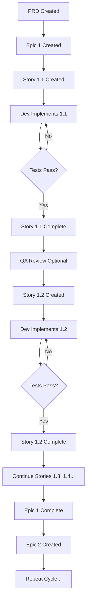

# BMAD Workflow Guide

**Your Personal Reference for the BMAD Development Method**

*Last Updated: 2025-10-04*

---

## Table of Contents

1. [Overview](#overview)
2. [The Complete Workflow](#the-complete-workflow)
3. [Phase 1: PRD (Product Requirements)](#phase-1-prd-product-requirements)
4. [Phase 2: Epic Creation](#phase-2-epic-creation)
5. [Phase 3: Story Creation](#phase-3-story-creation)
6. [Phase 4: Development](#phase-4-development)
7. [Phase 5: Quality Assurance](#phase-5-quality-assurance)
8. [Phase 6: Deployment](#phase-6-deployment)
9. [The Story Cycle](#the-story-cycle)
10. [BMAD Agents](#bmad-agents)
11. [Key Principles](#key-principles)
12. [Common Commands](#common-commands)
13. [FAQs](#faqs)
14. [Your Current Project Status](#your-current-project-status)

---

## Overview

**BMAD (Builder Methods Agile Development)** is a structured development methodology that uses AI agents to guide you through building software systematically.

Think of it like a production line with quality checks at each stage:

```
PRD → Epic → Story → Dev → QA → Deploy
 📋    📦     📝     💻    ✅     🚀
```

**Why BMAD?**
- **Prevents chaos:** No more "excitement-driven development"
- **Ensures completeness:** Every feature has requirements, tests, and docs
- **Enables collaboration:** Clear handoffs between planning and coding
- **Reduces risk:** Small, tested increments instead of big bang releases
- **Creates documentation:** Everything is tracked and documented

---

## The Complete Workflow



---

## Phase 1: PRD (Product Requirements)

### What is a PRD?

**PRD = Product Requirements Document**

The "master plan" for your entire product. It answers:
- **What** are we building?
- **Why** are we building it?
- **Who** is it for?
- **How** will we measure success?

### Your PRD

**Location:** `docs/prd.md` (42KB - comprehensive!)

**What it contains:**
- Project analysis and context
- Life domain architecture vision
- 8 life domains (Property, Vehicles, Employment, etc.)
- Functional requirements (FR1, FR2, FR3...)
- Success metrics
- Technical constraints
- Risk assessment

### Who Creates PRDs?

**PM Agent (John)** creates PRDs based on:
- User research
- Business goals
- Technical constraints
- Brainstorming sessions

### When to Create a PRD?

- **New projects:** Before any coding starts
- **Major features:** Life domain architecture transformation
- **Not needed for:** Small bug fixes, minor tweaks

---

## Phase 2: Epic Creation

### What is an Epic?

An **Epic** is a group of 3-8 related stories that together deliver a complete feature or capability.

**Think of it like building a house:**
- Epic 1 = Foundation & Plumbing
- Epic 2 = Electrical & HVAC
- Epic 3 = Interior Design

### Epic Structure

```markdown
# Epic X: Epic Name

## Epic Goal
What we're accomplishing and why

## Stories
1. Story X.1: First piece
2. Story X.2: Second piece
3. Story X.3: Third piece
...

## Risk Mitigation
What could go wrong and how we'll prevent it

## Definition of Done
How we know the epic is complete
```

### Your Epic 1

**Location:** `docs/stories/epic-1-life-domain-architecture-foundation.md`

**Contains:**
- 4 stories (1.1 through 1.4)
- Backend infrastructure focus
- Risk assessment and rollback plan
- Success criteria

### Who Creates Epics?

**PM Agent (John)** creates epics by:
- Reading the PRD
- Breaking down big features into logical chunks
- Sequencing stories in dependency order
- Defining risks and success criteria

### When to Create an Epic?

- **After PRD is approved**
- **Before creating individual stories**
- **When planning a major feature** (like life domain architecture)

---

## Phase 3: Story Creation

### What is a Story?

A **Story** is a single piece of work that can be completed in **1-2 dev sessions (4-12 hours)**.

**Anatomy of a Story:**

```markdown
# Story X.Y: Story Title

## User Story
As a [user type],
I want [goal],
so that [benefit].

## Acceptance Criteria
AC1: Specific requirement that must be met
AC2: Another specific requirement
AC3: ...

## Technical Specifications
- How to implement this
- What files to create/modify
- What patterns to follow

## Testing Guide
- How to test this manually
- What automated tests are needed

## Definition of Done
- [ ] All acceptance criteria met
- [ ] Tests passing
- [ ] Code reviewed
- [ ] Documentation updated
```

### Story 1.1 Example (Completed)

**Location:** `docs/stories/story-1.1-foundation-domain-models.md`

**What it delivered:**
- 8 Mongoose domain schemas
- CRUD API endpoints (`/api/domains/:domain/records`)
- 25 comprehensive tests (100% passing)
- User isolation and authentication
- Domain validation middleware

**Time taken:** ~1 dev session (4-8 hours)

### Story Numbering

**Format:** `Epic.Story` (e.g., 1.1, 1.2, 1.3)

- **Epic 1:** Stories 1.1, 1.2, 1.3, 1.4
- **Epic 2:** Stories 2.1, 2.2, 2.3
- **Epic 3:** Stories 3.1, 3.2, 3.3

### Who Creates Stories?

**PM Agent (John)** creates stories by:
- Reading the Epic
- Breaking down epic goals into implementable chunks
- Writing clear acceptance criteria
- Providing technical guidance

### When to Create a Story?

- **After Epic is created**
- **Before Dev Agent starts coding**
- **One at a time** (create 1.2 after 1.1 is complete)

---

## Phase 4: Development

### What Happens in Dev?

The **Dev Agent (James)** reads the story and:
1. Implements the code
2. Writes comprehensive tests
3. Runs all tests to ensure they pass
4. Updates the story file with completion notes
5. Marks story "Ready for Review"

### Dev Agent Workflow

```bash
# 1. Activate Dev Agent
/BMad:agents:dev

# 2. James greets you and shows commands
*help

# 3. Tell James to implement the story
*develop-story

# 4. James implements, tests, and completes
# (You watch the progress or let it run)

# 5. James marks story complete
Status: Ready for Review

# 6. Exit dev mode
*exit
```

### What Dev Creates

**Code Files:**
- New source files (models, routes, controllers)
- Modified existing files
- Test files

**Documentation:**
- Dev Agent Record in story file
- File list of changes
- Completion notes
- Debug log (if issues occurred)

### Story 1.1 Dev Output

**Files Created:**
- `src/models/domain/*.js` (8 domain schemas)
- `src/routes/domains.js` (domain router)
- `tests/api/domains.test.js` (25 tests)
- Architecture docs (tech-stack.md, coding-standards.md, source-tree.md)

**Dev Agent Record Added:**
- Agent model used (Claude Sonnet 4.5)
- Complete file list
- Completion notes (what was done)
- Change log (what changed)
- Debug log (any issues)

### Dev Agent Commands

| Command | What it Does |
|---------|-------------|
| `*help` | Show all available commands |
| `*develop-story` | Start implementing the current story |
| `*run-tests` | Run test suite |
| `*explain` | Explain what was just done (for learning) |
| `*exit` | Mark story complete and exit dev mode |

---

## Phase 5: Quality Assurance

### What is QA?

**Quality Assurance** is independent review and testing of completed work.

**QA checks:**
- ✅ Does it meet acceptance criteria?
- ✅ Do all tests pass?
- ✅ Is the code clean and maintainable?
- ✅ Did we break any existing functionality?
- ✅ Is documentation complete?

### Is QA Required?

**No!** QA is **optional** in BMAD.

**When to use QA:**
- Critical features (authentication, payments)
- Before production deployment
- When learning (QA agent teaches you what to look for)

**When to skip QA:**
- Dev agent wrote comprehensive tests
- Story is low-risk (backend-only, no user impact)
- You're confident in the implementation

### QA Agent Workflow

```bash
# 1. Activate QA Agent
/BMad:agents:qa

# 2. QA agent greets you and shows commands
*help

# 3. Tell QA to review the story
*review-story

# 4. QA runs tests, reviews code, checks acceptance criteria
# QA provides detailed feedback

# 5. QA marks story "Approved" or "Needs Fixes"
```

### Your Story 1.1 QA Status

**QA Not Performed** (optional)

**Why it's okay:**
- James (Dev) wrote 25 comprehensive tests
- All tests passing (100% pass rate)
- Backend-only changes (no user-facing impact)
- Existing auth and functionality preserved

---

## Phase 6: Deployment

### When to Deploy?

**After an Epic is complete:**
- All stories in the epic finished
- All tests passing
- QA approved (if performed)
- Documentation complete

### Deployment Process

```bash
# 1. Merge feature branch to main
git checkout main
git merge epic-1-life-domain-architecture

# 2. Run final tests
npm test

# 3. Deploy to production
# (Your deployment method: Vercel, Railway, etc.)

# 4. Monitor production
# Check logs, error rates, performance

# 5. Celebrate! 🎉
```

### Your Epic 1 Deployment Plan

**After Stories 1.1, 1.2, 1.3, 1.4 are complete:**
- Merge to main branch
- Deploy backend to production
- Verify APIs working in production
- Monitor MongoDB Atlas for performance
- Keep old system running (dual-system approach)

---

## The Story Cycle

For **each story**, you'll repeat this cycle:

### 1. Planning (PM Agent - John)

```
Input: Epic goals + PRD requirements
Process:
  - Review Epic and PRD
  - Create detailed Story document
  - Define acceptance criteria
  - Specify technical approach
  - Hand off to Dev Agent
Output: Story file (e.g., story-1.2-gridfs-document-storage.md)
```

### 2. Development (Dev Agent - James)

```
Input: Story file
Process:
  - Read Story requirements
  - Implement features
  - Write comprehensive tests
  - Run tests (must pass)
  - Update Story with completion notes
  - Mark Story "Ready for Review"
Output: Working code + tests + updated story file
```

### 3. Quality Assurance (Optional)

```
Input: Completed story + code
Process:
  - Review code changes
  - Test functionality manually
  - Run regression tests
  - Check acceptance criteria
  - Verify documentation
  - Mark Story "Approved" or "Needs Fixes"
Output: QA report + approval/rejection
```

### 4. Iteration (If Needed)

```
If QA finds issues:
  - Dev Agent fixes issues
  - Runs tests again
  - QA reviews again
  - Repeat until approved
```

---

## BMAD Agents

### Agent Overview

BMAD uses specialized AI agents, each with a specific role:

| Agent | Icon | Role | Key Commands |
|-------|------|------|-------------|
| **John (PM)** | 📋 | Product Manager | `*create-epic`, `*create-story`, `*create-prd` |
| **James (Dev)** | 💻 | Full Stack Developer | `*develop-story`, `*run-tests`, `*explain` |
| **QA Agent** | ✅ | Quality Assurance | `*review-story`, `*test-regression` |

### How to Activate Agents

```bash
# Activate PM Agent (John)
/BMad:agents:pm

# Activate Dev Agent (James)
/BMad:agents:dev

# Activate QA Agent
/BMad:agents:qa

# Exit any agent
*exit
```

### Agent Personas

**John (PM Agent):**
- Analytical and strategic
- Focuses on "why" and "what"
- Creates PRDs, Epics, and Stories
- Asks clarifying questions
- Data-driven decisions

**James (Dev Agent):**
- Pragmatic and detail-oriented
- Focuses on "how"
- Implements code
- Writes tests
- Updates documentation
- Extremely concise communication

**QA Agent:**
- Thorough and quality-focused
- Focuses on "does it work?"
- Reviews code
- Tests functionality
- Checks for regressions
- Validates acceptance criteria

### Agent Interaction Rules

**1. Only one agent active at a time**
```bash
# ❌ Wrong: Can't have both active
/BMad:agents:pm
/BMad:agents:dev  # Error!

# ✅ Correct: Exit first, then activate new agent
*exit  # Exit PM
/BMad:agents:dev  # Now activate Dev
```

**2. Agents stay in character**
- Don't ask James (Dev) to create a PRD
- Don't ask John (PM) to write code
- Use the right agent for the right task

**3. Clear handoffs**
- John creates story → hands off to James
- James completes code → hands off to QA
- QA approves → ready for deployment

---

## Key Principles

### 1. Each Agent Stays In Character

**John (PM):**
- ✅ Creates PRDs, Epics, Stories
- ✅ Analyzes requirements
- ✅ Plans strategy
- ❌ Doesn't write code
- ❌ Doesn't run tests

**James (Dev):**
- ✅ Writes code
- ✅ Creates tests
- ✅ Implements features
- ❌ Doesn't create PRDs
- ❌ Doesn't plan product strategy

### 2. Stories Must Be Atomic

**Atomic = Independently complete and testable**

✅ **Good Story:** "Add GridFS document storage"
- Can be tested independently
- Delivers value on its own
- Doesn't require other stories to work

❌ **Bad Story:** "Finish backend and frontend for documents"
- Too large (multiple concerns)
- Can't test until everything done
- Should be split into multiple stories

### 3. Documentation is Living

**Stories evolve as work progresses:**

```markdown
# Story 1.1 Lifecycle

## Created (PM Agent)
Status: Not Started
- User story written
- Acceptance criteria defined
- Technical specs provided

## In Progress (Dev Agent)
Status: In Progress
- Dev Agent Record section added
- File list populated
- Debug log updated if issues

## Complete (Dev Agent)
Status: Ready for Review
- Completion notes added
- Change log updated
- All tests passing

## Approved (QA Agent - Optional)
Status: Approved
- QA report added
- Acceptance criteria verified
- Ready for deployment
```

### 4. Safety Through Process

**Can't skip steps:**
- ❌ Can't code without a story
- ❌ Can't mark complete without tests
- ❌ Can't deploy without QA (optional but recommended)

**Why?**
- Prevents "excitement-driven development"
- Ensures quality and completeness
- Creates documentation trail
- Enables rollback if needed

### 5. Small, Tested Increments

**BMAD prefers:**
- ✅ Small stories (4-12 hours each)
- ✅ Comprehensive tests for each story
- ✅ Incremental delivery
- ✅ Continuous validation

**BMAD avoids:**
- ❌ Big bang releases
- ❌ Coding without tests
- ❌ Skipping documentation
- ❌ "We'll test it later"

---

## Common Commands

### PM Agent (John) Commands

```bash
# Show all commands
*help

# Create a new Epic
*create-epic

# Create a new Story (brownfield project)
*create-story

# Create a new PRD
*create-prd

# Exit PM mode
*exit
```

### Dev Agent (James) Commands

```bash
# Show all commands
*help

# Implement the current story
*develop-story

# Run tests
*run-tests

# Explain what was just done (for learning)
*explain

# Exit dev mode
*exit
```

### QA Agent Commands

```bash
# Show all commands
*help

# Review completed story
*review-story

# Run regression tests
*test-regression

# Exit QA mode
*exit
```

### General Commands

```bash
# Clear context (start fresh)
/clear

# Activate PM Agent
/BMad:agents:pm

# Activate Dev Agent
/BMad:agents:dev

# Activate QA Agent
/BMad:agents:qa
```

---

## FAQs

### Q: Do I need QA for every story?

**A:** No! QA is **optional**.

**Use QA when:**
- Working on critical features (auth, payments)
- Before production deployment
- When learning (QA teaches you what to look for)

**Skip QA when:**
- Dev wrote comprehensive tests
- Story is low-risk
- You're confident in the implementation

---

### Q: Can I modify a story after James starts?

**A:** Yes! Stories are living documents.

**How:**
1. Tell James about the changes
2. James adjusts implementation
3. James updates story file with new requirements

---

### Q: What if James gets stuck?

**A:** James will flag blockers and ask for clarification.

**Common blockers:**
- Ambiguous requirements → James asks PM for clarification
- Missing dependencies → James lists what's needed
- Technical limitations → James proposes alternatives

**Resolution:**
1. James flags the blocker
2. You (or John) provide clarification
3. James continues with updated info

---

### Q: How long does each story take?

**A:** Typically **4-12 hours** (1-2 dev sessions).

**Examples:**
- Story 1.1: ~6 hours (8 schemas + API + 25 tests)
- Story 1.2: ~8 hours (GridFS integration + tests)
- Story 1.3: ~5 hours (Validation + search)
- Story 1.4: ~10 hours (Data migration + rollback)

---

### Q: Can I work on multiple stories at once?

**A:** **Not recommended!**

**Why?**
- Risk of context switching errors
- Harder to track what's complete
- Merge conflicts likely
- Testing becomes complex

**Best practice:**
- Finish one story completely
- Get it reviewed (if using QA)
- Mark it done
- Then start the next story

---

### Q: What if I want to add a feature not in the PRD?

**A:** Update the PRD first!

**Process:**
1. Activate John (PM Agent)
2. Discuss the new feature
3. John updates PRD
4. John creates new Epic/Story
5. James implements

**Why?**
- Keeps PRD as "source of truth"
- Documents decision-making
- Prevents scope creep
- Enables proper planning

---

### Q: Can I skip writing tests?

**A:** **No!** Tests are mandatory in BMAD.

**Why?**
- Tests prove the code works
- Tests prevent regressions
- Tests document expected behavior
- James won't mark story complete without tests

**Test requirements:**
- All acceptance criteria must have tests
- All edge cases must be tested
- All tests must pass before story marked complete

---

### Q: What's the difference between brownfield and greenfield?

**Brownfield = Existing project**
- You have code already
- Need to integrate new features
- Must preserve existing functionality
- Your project: LegacyLock (brownfield)

**Greenfield = New project**
- Starting from scratch
- No existing code to work around
- More freedom in architecture decisions

---

### Q: How do I know when an Epic is done?

**A:** When all stories are complete!

**Epic 1 Complete When:**
- ✅ Story 1.1 complete (domain models) ✓
- ✅ Story 1.2 complete (GridFS)
- ✅ Story 1.3 complete (validation)
- ✅ Story 1.4 complete (migration)
- ✅ All tests passing
- ✅ QA approved (if performed)
- ✅ Documentation updated

---

### Q: What if I discover a bug in Story 1.1 while working on Story 1.2?

**A:** Fix it immediately!

**Process:**
1. Tell James about the bug
2. James fixes it in Story 1.1 code
3. James updates tests
4. James notes fix in Story 1.2's completion notes
5. Continue with Story 1.2

**Alternative:**
1. Create a new Story 1.5 for the bug fix
2. Implement Story 1.5 after 1.2
3. Keeps history clean

---

### Q: Can I use BMAD for small projects?

**A:** Yes, but simplified!

**Small project workflow:**
- ✅ Create 1 Epic (instead of multiple)
- ✅ Create 2-4 Stories
- ✅ Skip QA (Dev tests are enough)
- ✅ Deploy after Epic complete

**Large project workflow (your current project):**
- Create multiple Epics (Epic 1, 2, 3...)
- Create 4-8 Stories per Epic
- Use QA for critical features
- Deploy after each Epic

---

## Your Current Project Status

### Project: LegacyLock - Life Domain Architecture

**PRD Status:** ✅ Complete (`docs/prd.md`)

**Epic Status:**
- ✅ Epic 1: Life Domain Architecture Foundation (Created)
- ⏳ Epic 2: Renewal Dashboard Enhancement (Not yet created)
- ⏳ Epic 3: Frontend UI/UX Transformation (Not yet created)

**Story Status:**

**Epic 1 Stories:**
- ✅ Story 1.1: Domain Models & API Infrastructure (COMPLETE)
  - Status: Ready for Review
  - Dev: James (Claude Sonnet 4.5)
  - Tests: 25/25 passing
  - Files: 14 files created/modified

- ⏳ Story 1.2: GridFS Document Storage (NEXT - To be created)
- ⏳ Story 1.3: Record Management & Validation (Pending)
- ⏳ Story 1.4: Data Migration Utilities (Pending)

### What You've Learned So Far

✅ **PRD Creation** - Comprehensive product planning
✅ **Epic Organization** - Breaking big features into logical groups
✅ **Story Structure** - Understanding atomic, testable work units
✅ **Dev Agent Workflow** - Watched James implement Story 1.1
✅ **BMAD Process** - Understanding the full workflow

### Next Steps

1. **John creates Story 1.2** (GridFS Document Storage)
2. **You activate James** to implement Story 1.2
3. **James implements and tests** Story 1.2
4. **Repeat for Stories 1.3 and 1.4**
5. **Epic 1 Complete!** 🎉
6. **Create Epic 2** (Renewal Dashboard)

---

## Quick Reference Card

### BMAD Workflow Cheat Sheet

```
┌─────────────────────────────────────────────────────────┐
│ BMAD WORKFLOW QUICK REFERENCE                           │
├─────────────────────────────────────────────────────────┤
│ 1. CREATE PRD (John)                                    │
│    /BMad:agents:pm → *create-prd                        │
│                                                         │
│ 2. CREATE EPIC (John)                                   │
│    /BMad:agents:pm → *create-epic                       │
│                                                         │
│ 3. CREATE STORY (John)                                  │
│    /BMad:agents:pm → *create-story                      │
│                                                         │
│ 4. IMPLEMENT (James)                                    │
│    /BMad:agents:dev → *develop-story                    │
│                                                         │
│ 5. QA (Optional)                                        │
│    /BMad:agents:qa → *review-story                      │
│                                                         │
│ 6. REPEAT 3-5 for each story                           │
│                                                         │
│ 7. DEPLOY when Epic complete                           │
└─────────────────────────────────────────────────────────┘
```

### Agent Quick Commands

```
JOHN (PM) 📋
  *help          - Show commands
  *create-epic   - Create new epic
  *create-story  - Create new story
  *exit          - Leave PM mode

JAMES (DEV) 💻
  *help           - Show commands
  *develop-story  - Implement story
  *run-tests      - Run test suite
  *explain        - Explain what was done
  *exit           - Leave dev mode

QA ✅
  *help            - Show commands
  *review-story    - Review completed work
  *test-regression - Run full test suite
  *exit            - Leave QA mode
```

---

## Additional Resources

### Your Project Documentation

- **PRD:** `docs/prd.md`
- **Epic 1:** `docs/stories/epic-1-life-domain-architecture-foundation.md`
- **Story 1.1:** `docs/stories/story-1.1-foundation-domain-models.md`
- **Architecture:** `docs/architecture/` (tech-stack, coding-standards, source-tree)
- **Brief:** `docs/brief.md` (original project brief)
- **Brainstorming:** `docs/brainstorming-session-results.md`

### BMAD Configuration

- **Core Config:** `.bmad-core/core-config.yaml`
- **Agent Definitions:** `.bmad-core/agents/`
- **Tasks:** `.bmad-core/tasks/`
- **Templates:** `.bmad-core/templates/`

### External Resources

- **BMAD Documentation:** https://buildermethods.com/agent-os
- **Your GitHub Repo:** https://github.com/calvinorr/LegacyVault

---

## Tips for Success

### 1. Trust the Process
- Don't skip steps (even if tempting)
- Each phase builds on the previous
- Documentation saves you time later

### 2. Ask Questions
- Agents are here to help and teach
- No question is too basic
- Use `*explain` to understand what Dev did

### 3. Keep Stories Small
- 4-12 hours is ideal
- If a story feels too big, split it
- Atomic = testable + independent

### 4. Write Good Acceptance Criteria
- Be specific and measurable
- "Users can upload files" ✅
- "Make uploads work" ❌

### 5. Review Story Files
- Read completed stories to learn
- See what good tests look like
- Understand the patterns

### 6. Celebrate Progress
- Story complete? Celebrate! 🎉
- Epic complete? Celebrate harder! 🎊
- PRD complete? You shipped a product! 🚀

---

**Remember:** BMAD is designed to help you build better software, faster, with less stress. The structure might feel rigid at first, but it prevents the chaos of "excitement-driven development."

**You've got this!** 💪

---

*Last Updated: 2025-10-04*
*Project: LegacyLock - Life Domain Architecture*
*Guide Version: 1.0*
